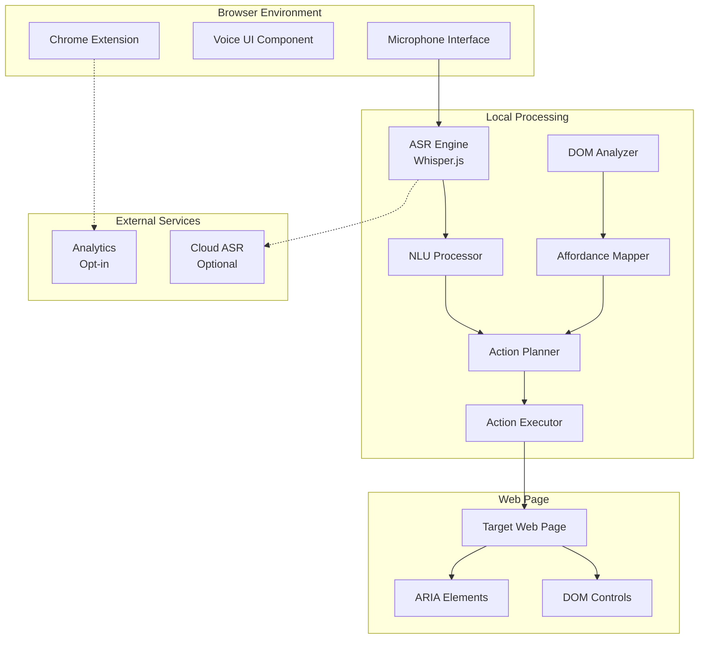
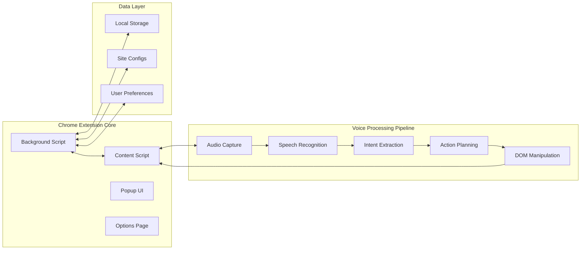
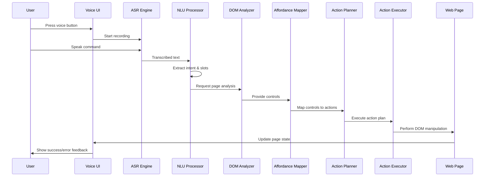
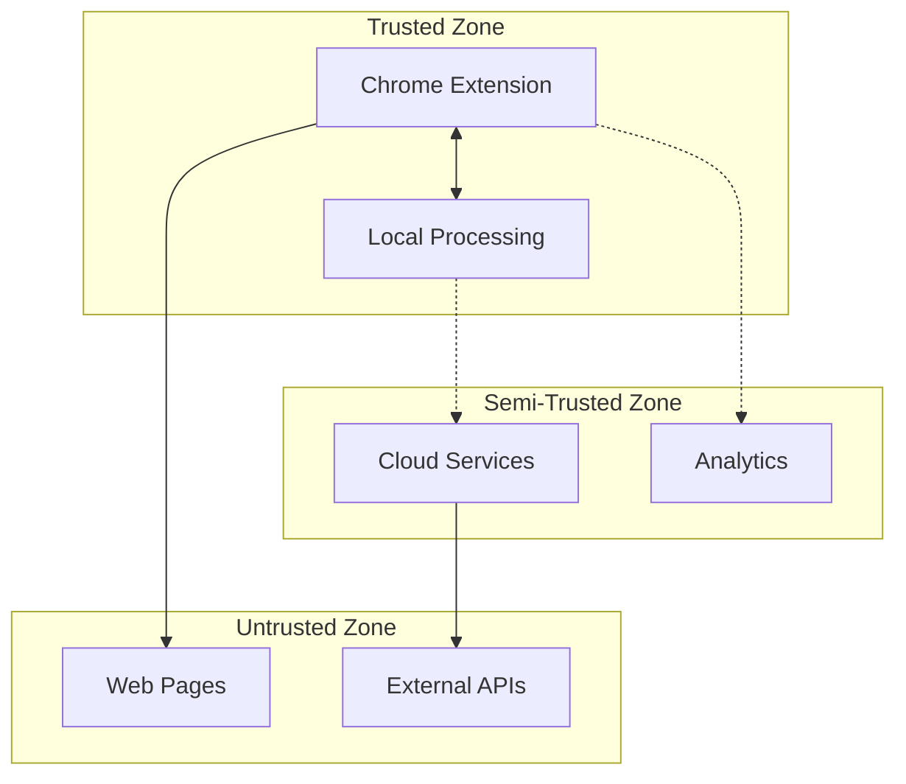
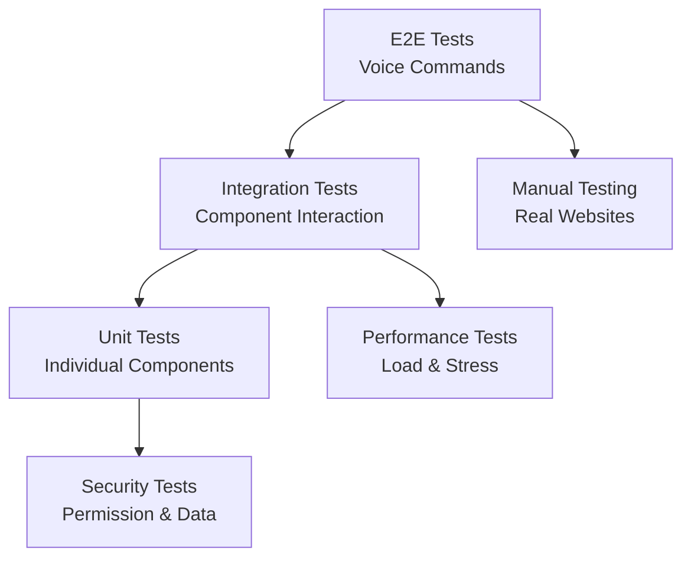

# System Design Document (SDD)

## 🏗️ Architecture Overview

**Project:** Voice-Driven Chrome Extension for Web Search & Actions  
**Version:** MVP  
**Architecture Type:** Microservices with Chrome Extension Frontend  
**Status:** Design Phase  

---

## 🎯 1. System Architecture

### High-Level Architecture



### Component Architecture



---

## 🤖 2. AI/ML Models & APIs

### 2.1 Hugging Face Model Architecture

#### Speech Recognition Models
```typescript
interface WhisperConfig {
  model: 'openai/whisper-tiny.en' | 'openai/whisper-base.en' | 'openai/whisper-small.en' | 'openai/whisper-medium.en';
  task: 'transcribe';
  language: 'en';
  chunk_length_s: 30;
  stride_length_s: 5;
}

// Model Selection Strategy
const ASR_MODELS = {
  'fast': 'openai/whisper-tiny.en',      // 39MB, ~1s processing
  'balanced': 'openai/whisper-base.en',  // 74MB, ~1.5s processing  
  'accurate': 'openai/whisper-small.en', // 244MB, ~2s processing
  'premium': 'openai/whisper-medium.en'  // 769MB, ~3s processing
};
```

#### Natural Language Understanding Models
```typescript
interface NLUConfig {
  intent_classifier: {
    model: 'microsoft/DialoGPT-medium';
    max_length: 512;
    num_labels: 5;
    labels: ['search', 'filter', 'navigate', 'scroll', 'unknown'];
  };
  slot_extractor: {
    model: 'facebook/bart-base';
    max_length: 256;
    entity_types: ['price', 'location', 'category', 'size', 'color', 'brand'];
  };
  command_normalizer: {
    model: 'distilbert-base-uncased';
    max_length: 128;
  };
  semantic_matcher: {
    model: 'sentence-transformers/all-MiniLM-L6-v2';
    similarity_threshold: 0.7;
  };
}
```

### 2.2 API Integration Strategy

#### Primary: Hugging Face Inference API
```typescript
interface HuggingFaceConfig {
  api_url: 'https://api-inference.huggingface.co/models';
  api_key: string;
  models: {
    whisper: 'openai/whisper-base.en';
    intent: 'microsoft/DialoGPT-medium';
    slots: 'facebook/bart-base';
    normalize: 'distilbert-base-uncased';
    semantic: 'sentence-transformers/all-MiniLM-L6-v2';
  };
  timeout: 10000; // 10 seconds
  retry_attempts: 3;
}
```

#### Fallback: Cloud Speech APIs
```typescript
interface CloudASRConfig {
  google: {
    api_key: string;
    model: 'latest_long';
    language_code: 'en-US';
    sample_rate: 16000;
  };
  azure: {
    subscription_key: string;
    region: string;
    language: 'en-US';
    format: 'detailed';
  };
  aws: {
    access_key: string;
    secret_key: string;
    region: string;
    language_code: 'en-US';
  };
}
```

### 2.3 Model Loading & Caching Strategy

#### Dynamic Model Loading
```typescript
interface ModelManager {
  loadModel(modelId: string): Promise<Model>;
  unloadModel(modelId: string): void;
  getModelStatus(modelId: string): ModelStatus;
  preloadModels(priority: string[]): Promise<void>;
}

interface ModelStatus {
  loaded: boolean;
  loading: boolean;
  size: number;
  last_used: Date;
  memory_usage: number;
}
```

#### Model Caching Strategy
- **Lazy Loading:** Load models only when needed
- **Memory Management:** Unload unused models after 5 minutes
- **Preloading:** Load most common models on extension startup
- **Size Optimization:** Use quantized models when available

### 2.4 Implementation Details

#### Hugging Face Transformers.js Integration
```typescript
import { pipeline, Pipeline } from '@xenova/transformers';

class ModelService {
  private whisperPipeline: Pipeline | null = null;
  private intentPipeline: Pipeline | null = null;
  private slotPipeline: Pipeline | null = null;

  async initializeModels() {
    // Initialize Whisper for ASR
    this.whisperPipeline = await pipeline(
      'automatic-speech-recognition',
      'Xenova/whisper-tiny.en'
    );

    // Initialize intent classification
    this.intentPipeline = await pipeline(
      'text-classification',
      'microsoft/DialoGPT-medium'
    );

    // Initialize slot filling
    this.slotPipeline = await pipeline(
      'token-classification',
      'facebook/bart-base'
    );
  }

  async transcribeAudio(audioBuffer: AudioBuffer): Promise<string> {
    if (!this.whisperPipeline) throw new Error('Whisper not initialized');
    return await this.whisperPipeline(audioBuffer);
  }

  async classifyIntent(text: string): Promise<Intent> {
    if (!this.intentPipeline) throw new Error('Intent classifier not initialized');
    const result = await this.intentPipeline(text);
    return {
      type: result[0].label,
      confidence: result[0].score,
      action: this.mapIntentToAction(result[0].label)
    };
  }
}
```

#### Model Performance Optimization
```typescript
interface ModelOptimization {
  // Quantization for smaller models
  quantization: 'int8' | 'int4' | 'fp16';
  
  // Dynamic batching for multiple requests
  batch_size: number;
  
  // Model pruning for faster inference
  pruning_ratio: number;
  
  // ONNX Runtime for optimized execution
  runtime: 'onnx' | 'tensorflow' | 'pytorch';
}
```

#### Error Handling & Fallbacks
```typescript
interface ModelFallback {
  primary: 'huggingface';
  secondary: 'rule-based';
  tertiary: 'cloud-api';
  
  fallback_triggers: {
    low_confidence: 0.6;
    timeout: 5000;
    memory_limit: '100MB';
    error_rate: 0.1;
  };
}
```

### 2.5 API Usage Patterns & Costs

#### Hugging Face API Usage
```typescript
interface APIUsage {
  // Free tier limits
  free_tier: {
    requests_per_month: 1000;
    concurrent_requests: 2;
    model_cache_time: '24h';
  };
  
  // Paid tier benefits
  pro_tier: {
    requests_per_month: 'unlimited';
    concurrent_requests: 10;
    priority_queue: true;
    custom_models: true;
  };
  
  // Cost optimization
  optimization: {
    model_caching: true;
    request_batching: true;
    local_fallback: true;
  };
}
```

#### Model Selection Matrix
| Use Case | Model | Size | Speed | Accuracy | Cost |
|----------|-------|------|-------|----------|------|
| **Quick Commands** | whisper-tiny | 39MB | ~1s | 85% | Free |
| **Balanced** | whisper-base | 74MB | ~1.5s | 90% | Free |
| **High Accuracy** | whisper-small | 244MB | ~2s | 95% | Free |
| **Premium** | whisper-medium | 769MB | ~3s | 98% | Free |

#### API Rate Limiting Strategy
```typescript
interface RateLimiting {
  // Request throttling
  throttling: {
    max_requests_per_minute: 60;
    burst_limit: 10;
    backoff_strategy: 'exponential';
  };
  
  // Queue management
  queue: {
    max_queue_size: 100;
    priority_levels: ['high', 'medium', 'low'];
    timeout: 30000; // 30 seconds
  };
  
  // Fallback triggers
  fallback: {
    queue_full: 'rule-based';
    rate_limit: 'local-processing';
    timeout: 'cached-response';
  };
}
```

---

## 🔧 3. Core Components

### 2.1 Chrome Extension Architecture

#### Background Script (Service Worker)
- **Purpose:** Central coordination and state management
- **Responsibilities:**
  - Extension lifecycle management
  - Cross-tab communication
  - User preference management
  - Analytics data collection (opt-in)

#### Content Script
- **Purpose:** Page interaction and DOM manipulation
- **Responsibilities:**
  - DOM analysis and control discovery
  - Action execution on web pages
  - Communication with background script
  - SPA state management

#### Popup UI
- **Purpose:** User interface and controls
- **Responsibilities:**
  - Voice activation controls
  - Status indicators
  - Settings access
  - Error feedback display

### 2.2 Voice Processing Pipeline

#### Audio Capture Module
```typescript
interface AudioCapture {
  startRecording(): Promise<void>;
  stopRecording(): Promise<AudioBuffer>;
  getAudioLevel(): number;
  isRecording(): boolean;
}
```

#### Speech Recognition Engine
```typescript
interface ASREngine {
  transcribe(audio: AudioBuffer): Promise<string>;
  setLanguage(lang: string): void;
  getConfidence(): number;
}

// ASR Implementation Options
interface ASRConfig {
  provider: 'whisper' | 'huggingface' | 'google' | 'azure' | 'aws';
  model: string;
  apiKey?: string;
  endpoint?: string;
}
```

### 2.2.1 ASR Model Selection

#### Primary: Hugging Face Whisper Models
- **Model:** `openai/whisper-tiny.en` (39MB) - Fastest, lowest accuracy
- **Model:** `openai/whisper-base.en` (74MB) - Balanced speed/accuracy
- **Model:** `openai/whisper-small.en` (244MB) - Higher accuracy
- **Model:** `openai/whisper-medium.en` (769MB) - Best accuracy for MVP

#### Fallback: Cloud APIs
- **Google Speech-to-Text API**
- **Azure Cognitive Services Speech**
- **AWS Transcribe**

#### Natural Language Understanding
```typescript
interface NLUProcessor {
  extractIntent(text: string): Intent;
  extractSlots(text: string, intent: Intent): Slot[];
  normalizeCommand(text: string): string;
}

interface Intent {
  type: 'search' | 'filter' | 'navigate' | 'scroll';
  confidence: number;
  action: string;
}

interface Slot {
  name: string;
  value: string;
  confidence: number;
}
```

### 2.2.2 NLU Model Selection

#### Primary: Hugging Face Transformers
- **Model:** `microsoft/DialoGPT-medium` - For intent classification
- **Model:** `facebook/bart-base` - For slot filling and entity extraction
- **Model:** `distilbert-base-uncased` - For command normalization
- **Model:** `sentence-transformers/all-MiniLM-L6-v2` - For semantic similarity

#### Intent Classification Pipeline
```typescript
interface IntentClassifier {
  model: 'microsoft/DialoGPT-medium' | 'facebook/bart-base';
  labels: ['search', 'filter', 'navigate', 'scroll', 'unknown'];
  threshold: 0.7;
}

interface SlotExtractor {
  model: 'facebook/bart-base';
  entities: ['price', 'location', 'category', 'size', 'color'];
  confidence_threshold: 0.6;
}
```

#### Fallback: Rule-Based NLU
- **Pattern Matching:** Regex-based intent detection
- **Keyword Extraction:** Simple keyword-based classification
- **Template Matching:** Predefined command templates

### 2.3 DOM Analysis & Control Discovery

#### DOM Analyzer
```typescript
interface DOMAnalyzer {
  scanPage(): Control[];
  findSearchInputs(): HTMLInputElement[];
  findFilterControls(): HTMLElement[];
  findNavigationElements(): HTMLElement[];
  findScrollableContainers(): HTMLElement[];
}

interface Control {
  element: HTMLElement;
  type: 'search' | 'filter' | 'button' | 'link' | 'select';
  label: string;
  selector: string;
  confidence: number;
}
```

#### Affordance Mapper
```typescript
interface AffordanceMapper {
  mapControlsToActions(controls: Control[]): ActionMap;
  getGenericActions(): Action[];
  updateSiteMapping(site: string, mapping: ActionMap): void;
}

interface ActionMap {
  [intent: string]: Action[];
}

interface Action {
  id: string;
  type: string;
  element: HTMLElement;
  parameters: Record<string, any>;
  confidence: number;
}
```

### 2.4 Action Planning & Execution

#### Action Planner
```typescript
interface ActionPlanner {
  planAction(intent: Intent, slots: Slot[], actions: Action[]): ActionPlan;
  validateAction(action: Action): boolean;
  getFallbackAction(intent: Intent): Action;
}

interface ActionPlan {
  actions: Action[];
  confidence: number;
  fallback?: Action;
}
```

#### Action Executor
```typescript
interface ActionExecutor {
  executeAction(action: Action): Promise<ActionResult>;
  handleSPA(action: Action): Promise<ActionResult>;
  retryAction(action: Action, maxRetries: number): Promise<ActionResult>;
}

interface ActionResult {
  success: boolean;
  message?: string;
  nextActions?: Action[];
}
```

---

## 🗄️ 3. Data Models

### 3.1 Core Data Structures

```typescript
// User Configuration
interface UserConfig {
  language: string;
  asrProvider: 'local' | 'cloud';
  cloudProvider?: 'google' | 'azure' | 'aws';
  enableAnalytics: boolean;
  keyboardShortcut: string;
  voiceActivation: 'push-to-talk' | 'always-on';
}

// Site Configuration
interface SiteConfig {
  domain: string;
  selectors: {
    searchInput: string[];
    filterControls: string[];
    navigationElements: string[];
    resultContainers: string[];
  };
  customActions: CustomAction[];
  lastUpdated: Date;
}

// Custom Action Definition
interface CustomAction {
  id: string;
  name: string;
  pattern: RegExp;
  selector: string;
  actionType: 'click' | 'input' | 'select' | 'scroll';
  parameters: string[];
}

// Voice Command History
interface CommandHistory {
  timestamp: Date;
  command: string;
  intent: Intent;
  success: boolean;
  executionTime: number;
  site: string;
}

// Analytics Data (Opt-in)
interface AnalyticsData {
  userId: string;
  sessionId: string;
  commands: CommandHistory[];
  performance: PerformanceMetrics;
  errors: ErrorLog[];
}
```

### 3.2 Storage Schema

```typescript
// Chrome Storage API Structure
interface StorageSchema {
  userConfig: UserConfig;
  siteConfigs: Record<string, SiteConfig>;
  commandHistory: CommandHistory[];
  analyticsData?: AnalyticsData;
  lastActiveSite: string;
  extensionVersion: string;
}
```

---

## 🔄 4. System Flow

### 4.1 Voice Command Processing Flow



### 4.2 Error Handling Flow

```mermaid
flowchart TD
    A[Voice Command Received] --> B{ASR Success?}
    B -->|No| C[Show "Please try again"]
    B -->|Yes| D{NLU Success?}
    D -->|No| E[Show "Command not understood"]
    D -->|Yes| F{Action Found?}
    F -->|No| G[Show "Action not available"]
    F -->|Yes| H{Execution Success?}
    H -->|No| I[Retry with fallback]
    H -->|Yes| J[Show success feedback]
    I --> K{Retry Success?}
    K -->|No| L[Show error message]
    K -->|Yes| J
```

---

## 🚀 5. Performance Considerations

### 5.1 Performance Targets

| Component | Target | Measurement |
|-----------|--------|-------------|
| **Audio Capture** | < 100ms | Time to start recording |
| **Speech Recognition** | < 2s | Local Whisper.js processing |
| **DOM Analysis** | < 200ms | Page scan completion |
| **Action Execution** | < 500ms | DOM manipulation |
| **Total Pipeline** | < 3s | End-to-end processing |

### 5.2 Optimization Strategies

#### Memory Management
- **Audio Buffer Pooling:** Reuse audio buffers to reduce GC pressure
- **DOM Caching:** Cache frequently accessed elements
- **Lazy Loading:** Load site configs only when needed

#### Processing Optimization
- **Parallel Processing:** Run ASR and DOM analysis concurrently
- **Incremental Updates:** Update only changed DOM elements
- **Smart Caching:** Cache successful action patterns

#### Network Optimization
- **Local-First:** Default to local processing
- **Compression:** Compress analytics data
- **Batching:** Batch multiple commands for cloud processing

---

## 🔒 6. Security & Privacy

### 6.1 Security Model



### 6.2 Privacy Protection

#### Data Minimization
- **No Audio Storage:** Audio data not persisted
- **Local Processing:** Default to on-device processing
- **Opt-in Analytics:** User consent required for data collection

#### Permission Model
```typescript
interface Permissions {
  microphone: boolean;        // Required for voice input
  activeTab: boolean;         // Required for page interaction
  storage: boolean;           // Required for user preferences
  scripting: boolean;         // Required for DOM manipulation
}
```

#### Data Encryption
- **In-Transit:** HTTPS for all external communications
- **At-Rest:** Chrome's built-in storage encryption
- **Local Processing:** No sensitive data leaves device

---

## 🧪 7. Testing Strategy

### 7.1 Testing Pyramid



### 7.2 Test Categories

#### Unit Tests
- **ASR Engine:** Transcription accuracy
- **NLU Processor:** Intent extraction
- **DOM Analyzer:** Control discovery
- **Action Executor:** DOM manipulation

#### Integration Tests
- **Voice Pipeline:** End-to-end command processing
- **Site Compatibility:** Major website testing
- **Error Handling:** Failure scenario testing

#### Performance Tests
- **Load Testing:** Multiple concurrent commands
- **Memory Testing:** Long-running sessions
- **Latency Testing:** Response time validation

---

## 📊 8. Monitoring & Observability

### 8.1 Metrics Collection

```typescript
interface Metrics {
  // Performance Metrics
  commandLatency: number;
  transcriptionTime: number;
  executionTime: number;
  
  // Success Metrics
  commandSuccessRate: number;
  intentAccuracy: number;
  actionSuccessRate: number;
  
  // Usage Metrics
  commandsPerSession: number;
  popularCommands: string[];
  siteUsage: Record<string, number>;
  
  // Error Metrics
  errorRate: number;
  errorTypes: Record<string, number>;
  retryRate: number;
}
```

### 8.2 Logging Strategy

#### Log Levels
- **ERROR:** Critical failures requiring attention
- **WARN:** Recoverable issues and fallbacks
- **INFO:** Normal operation flow
- **DEBUG:** Detailed execution traces

#### Log Categories
- **Voice Processing:** ASR and NLU operations
- **DOM Operations:** Page analysis and manipulation
- **User Actions:** Command execution and results
- **System Events:** Extension lifecycle and errors

---

## 🔄 9. Deployment & Rollout

### 9.1 Deployment Strategy

#### Phase 1: Alpha (Internal)
- **Target:** Development team
- **Features:** Core voice processing
- **Sites:** 5-10 test websites
- **Duration:** 2-3 weeks

#### Phase 2: Beta (Limited Users)
- **Target:** 100-500 beta users
- **Features:** Full MVP functionality
- **Sites:** 20-50 major websites
- **Duration:** 4-6 weeks

#### Phase 3: Public Release
- **Target:** General public
- **Features:** Stable MVP + initial feedback
- **Sites:** Broad compatibility
- **Duration:** Ongoing

### 9.2 Rollback Strategy

#### Automatic Rollback Triggers
- **Error Rate:** > 10% command failures
- **Performance:** > 5s average latency
- **Crash Rate:** > 1% extension crashes

#### Manual Rollback Process
1. **Immediate:** Disable new version
2. **Investigation:** Analyze failure causes
3. **Fix:** Deploy corrected version
4. **Validation:** Verify fix effectiveness

---

## 🔮 10. Future Considerations

### 10.1 Scalability Roadmap

#### Phase 2 Enhancements
- **Site Adapters:** Custom handlers for complex sites
- **Teach Mode:** User-defined command mappings
- **Advanced NLU:** Context-aware command processing

#### Phase 3 Vision
- **Multi-language Support:** International voice commands
- **AI-Powered Suggestions:** Smart command recommendations
- **Cross-Platform:** Mobile and desktop support

### 10.2 Technical Debt Management

#### Code Quality
- **TypeScript:** Strict type checking
- **ESLint:** Code style enforcement
- **Prettier:** Consistent formatting
- **Husky:** Pre-commit hooks

#### Documentation
- **API Documentation:** Auto-generated from code
- **Architecture Decision Records:** Document design choices
- **User Guides:** Comprehensive usage documentation

---

## 📋 11. Implementation Timeline

### 11.1 Development Phases

| Phase | Duration | Deliverables |
|-------|----------|--------------|
| **Foundation** | 2 weeks | Core extension structure, basic voice capture |
| **Voice Processing** | 3 weeks | ASR integration, NLU implementation |
| **DOM Analysis** | 2 weeks | Control discovery, affordance mapping |
| **Action Execution** | 2 weeks | DOM manipulation, SPA handling |
| **Integration** | 2 weeks | End-to-end pipeline, error handling |
| **Testing** | 2 weeks | Comprehensive testing, bug fixes |
| **Polish** | 1 week | UI improvements, performance optimization |

### 11.2 Milestones

- **Week 2:** Basic voice capture working
- **Week 5:** Voice commands processed locally
- **Week 7:** DOM analysis and control discovery
- **Week 9:** Action execution on web pages
- **Week 11:** Complete voice-to-action pipeline
- **Week 13:** Production-ready MVP

---

*Last Updated: [Current Date]*  
*Document Owner: [Engineering Team]*  
*Reviewers: [Product Team, Security Team]*
